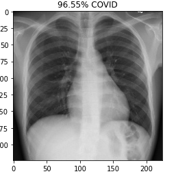
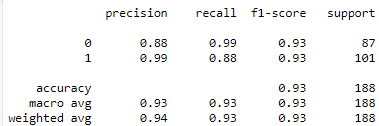
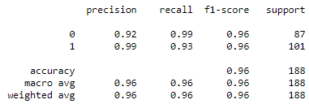
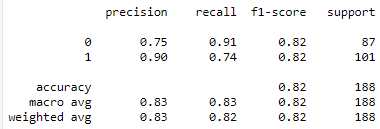
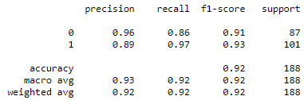
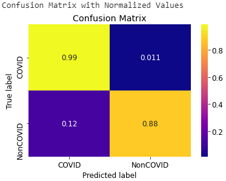
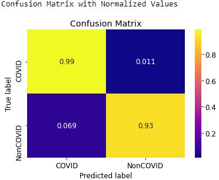
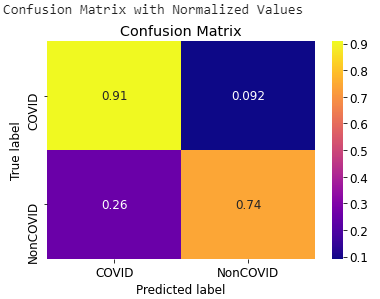
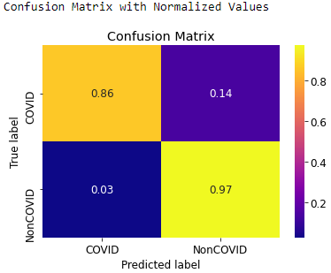

# COVID-19-Detection-based-on-Chest-X-rays
COVID-19 Detection based on Chest X-rays using four Transfer Learning algorithms: VGG16, ResNet50, InceptionV3, Xception. The models were trained for 500 epochs on around 1000 Chest X-rays images on Google Colab GPU. After training, the accuracies acheived for the model are as follows:
<pre>
                InceptionV3  VGG16   ResNet50   Xception
Chest X-rays    96%          94%      83%       92%

</pre>

# Dataset
The dataset for the project was gathered from two sources:
Chest X-ray images (1000 images) were obtained from: https://github.com/ieee8023/covid-chestxray-dataset

# Evaluation and Results
<h3>Sample output of test images</h3> 

 

<h3>Classification Reports for Chest X-rays:  VGG, InceptionV3, ResNet50, Xception </h3>

 

 

<h3>Confusion Matrix for Chest X-rays:  VGG, InceptionV3, ResNet50, Xception </h3>

 

 

# Technical Concepts
<b>ImageNet</b> is formally a project aimed at (manually) labeling and categorizing images into almost 22,000 separate object categories for the purpose of computer vision research. 
More information can be found <a href="https://www.pyimagesearch.com/2017/03/20/imagenet-vggnet-resnet-inception-xception-keras/">here</a>
 
 
<b>ResNet50</b> ResNet-50 is a convolutional neural network that is 50 layers deep. You can load a pretrained version of the network trained on more than a million images from the ImageNet database. The pretrained network can classify images into 1000 object categories, such as keyboard, mouse, pencil, and many animals. Unlike traditional sequential network architectures such as AlexNet, OverFeat, and VGG, ResNet is instead a form of “exotic architecture” that relies on micro-architecture modules. 
More information can be found <a href="https://www.mathworks.com/help/deeplearning/ref/resnet50.html#:~:text=ResNet%2D50%20is%20a%20convolutional,%2C%20pencil%2C%20and%20many%20animals.">here</a>
 
 
<b>VGG16</b> is a convolutional neural network model proposed by K. Simonyan and A. Zisserman from the University of Oxford in the paper “Very Deep Convolutional Networks for Large-Scale Image Recognition”. The model achieves 92.7% top-5 test accuracy in ImageNet, which is a dataset of over 14 million images belonging to 1000 classes.  
More information can be found <a href="https://www.mathworks.com/help/deeplearning/ref/resnet50.html#:~:text=ResNet%2D50%20is%20a%20convolutional,%2C%20pencil%2C%20and%20many%20animals.">here</a>
 
 
<b>Inception-V3</b> is a convolutional neural network that is 48 layers deep. You can load a pretrained version of the network trained on more than a million images from the ImageNet database. The pretrained network can classify images into 1000 object categories, such as keyboard, mouse, pencil, and many animals. As a result, the network has learned rich feature representations for a wide range of images. The network has an image input size of 299-by-299. 
More information can be found <a href="https://www.mathworks.com/help/deeplearning/ref/resnet50.html#:~:text=ResNet%2D50%20is%20a%20convolutional,%2C%20pencil%2C%20and%20many%20animals.">here</a>
 
 
<b>Xception</b> is a convolutional neural network that is 71 layers deep. You can load a pretrained version of the network trained on more than a million images from the ImageNet database. The pretrained network can classify images into 1000 object categories, such as keyboard, mouse, pencil, and many animals. As a result, the network has learned rich feature representations for a wide range of images. The network has an image input size of 299-by-299.  
More information can be found <a href="https://www.mathworks.com/help/deeplearning/ref/resnet50.html#:~:text=ResNet%2D50%20is%20a%20convolutional,%2C%20pencil%2C%20and%20many%20animals.">here</a>

## How to use Jupyter Notebooks 
<ul>
  <li>Download my repo and upload the repo folder to your <b>Google Drive</b></li>
  <li>Go to the jupyter notebooks folder in my repo, right click the notebook you want to open and select <b>Open with Google Colab</b>   </li>
  <li>Activate free <b>Google Colab GPU</b> for faster execution. Go to Runtime -> Change Runtime Type -> Hardware Accelerator -> GPU -> Save</li>
</ul>

# Authors
## Devashish Attri
## Gagan Aggarwal

